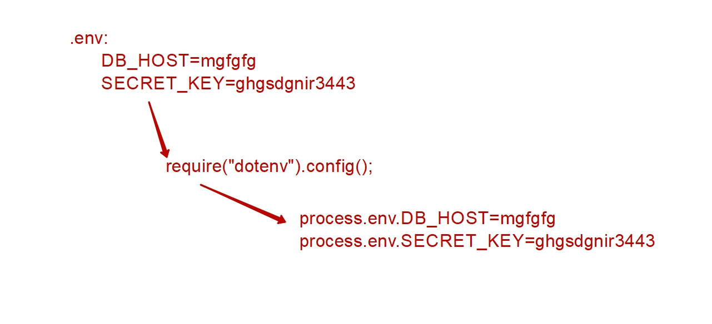
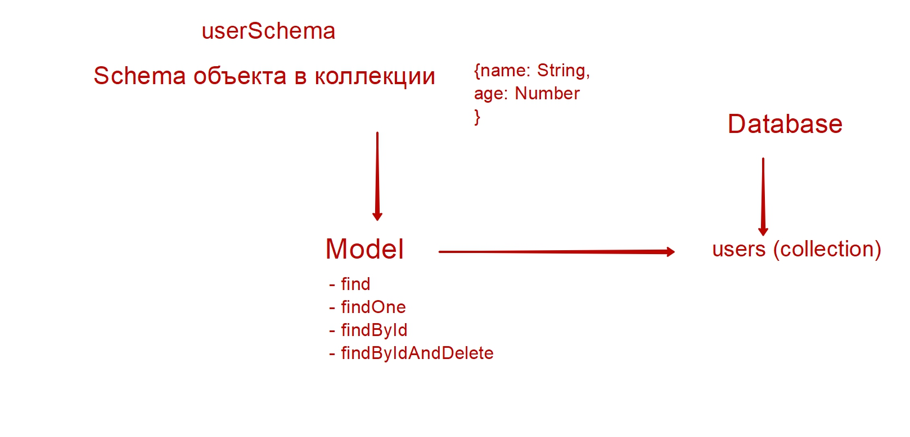

## books-reader-backend
Mod03-1-2

GET  https://books-reader-backend-197l.onrender.com/api/books/  
GET  https://books-reader-backend-197l.onrender.com/api/books/:id  
POST https://books-reader-backend-197l.onrender.com/api/books  
{
    "title": "Name book - MongoDB ",
    "author": "Author",
    "genre": "fantastic",
    "date": "30-11-2023"
}
https://books-reader-backend-197l.onrender.com/api/books/:id
{
    "title": "Name book - MongoDB - 2 -PUT",
    "author": "Author",
    "genre": "fantastic",
    "date": "30-11-2023"
}
https://books-reader-backend-197l.onrender.com/api/books/:id/favorite
{
    "favorite": true
}
https://books-reader-backend-197l.onrender.com/api/books/:id

###

